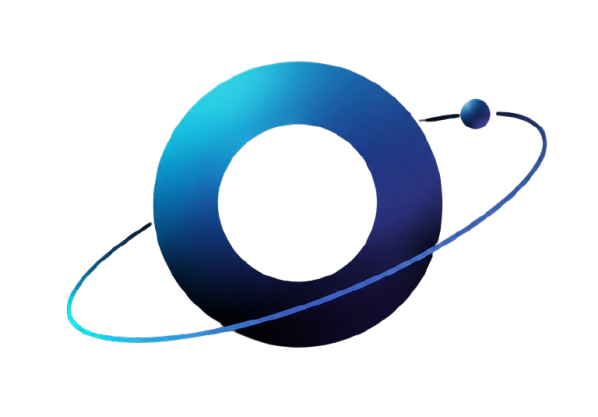

<div align="center">
  
  
  # IRIS: The Intelligence Layer Between You and Your OS
  
  **Universal OS Automation & Workflow Memory**  
  *No APIs. No Integrations. If a human can see it and click it, IRIS can work with it.*
</div>

---

## ⚠️ The Fragmentation of OS-Level Automation

- **The "State Loss" Problem:** Modern OS architectures are volatile state machines. They instantly drop contextual memory the second a user switches tasks, forcing humans to manually reconstruct complex workflows.
- **The API Barrier:** Existing tools (Zapier, Make) rely on rigid, vendor-provided APIs. They are mathematically incapable of automating proprietary apps, local legacy software, or offline systems.
- **Fragile Static RPA:** Traditional macro bots blindly click fixed coordinates. They lack "Visual Independence" and break instantly during UI updates or window resizing.
- **The "Passive" OS Vulnerability:** Current operating systems blindly render pixels. They lack an "Intelligence Layer"—they cannot analyze the intent of a cross-app workflow without human intervention.

## 🧠 What is IRIS?

IRIS is an **Active Intelligence Layer** that sits natively between you and your Operating System. 

It completely bypasses vendor APIs, allowing you to pipe data from any application on your screen to any other application using natural language and visual intent. 

```mermaid
graph TD
    A[Source App<br/>(Visual/DOM/UI)] -->|Ctrl+K Overlay| I((IRIS<br/>Intelligence Layer))
    I -->|Natural Language Intent| L[Local LLM / Vision]
    L --> I
    I -->|Synthetic OS Events| B[Target App<br/>(Form/Button)]

    style I fill:#4A90E2,stroke:#fff,stroke-width:2px,color:#fff
    style A fill:#1a1a1a,stroke:#888,color:#fff
    style B fill:#1a1a1a,stroke:#888,color:#fff
```

- **Ambient Memory:** Silently builds a permanent timeline of your cross-app workflow.
- **Spatial UI:** Trigger a global overlay, draw connecting boxes, and type your rule.
- **Event-Driven:** Watches for visual triggers and fires background OS events autonomously.

## 🚀 The Three Execution Modes

### 1. NOW (Ad-Hoc Routing)
Point at data on one app. Point at a form on another. Type: *"Extract this invoice and populate it."* IRIS maps the data fields semantically and uses OS accessibility hooks to fill the target instantly—without taking over your mouse.

### 2. WHEN (Watch & Strike)
The core event loop. Draw a trigger zone, draw a target arrow, and type *"When this says 'Success', click that button."* IRIS spins up an isolated background thread, polls the screen zone, and fires the click event autonomously upon a state match. You walk away from the keyboard.

### 3. ALWAYS (Continuous Sync) & TIMELINE (State Restoration)
Keeps disconnected apps perfectly synced without network API calls. Simultaneously, IRIS logs your active environment into a local database. Use the query drawer to ask *"What file was I editing during my presentation review?"* to instantly restore an exact workspace.

---

## 🛠️ Tech Stack & Architecture

**The Three-Layer Hybrid Engine**

IRIS ensures zero-ambiguity text and UI extraction by utilizing a 3-layer hybrid fallback system:
1. **Layer 1 (The Web):** `Playwright` hooks directly into the browser DOM via CDP for perfect, zero-latency extraction.
2. **Layer 2 (Native OS):** `pywinauto` leverages native Windows UI Automation APIs to read app structures as queryable objects and fire invisible background clicks (no cursor hijacking).
3. **Layer 3 (Fallback Vision):** If an app blocks accessibility, IRIS gracefully falls back to `EasyOCR` for localized pixel extraction.

**Core Infrastructure:**
- **Frontend Overlay:** Electron, React, TypeScript.
- **Core Engine:** Python daemon running a FastAPI server.
- **Intent Engine:** Local LLMs (Llama 3 via Ollama) parse automation commands, while Gemini 2.5 Flash maps unstructured text fields.
- **State Memory:** `ChromaDB` stores vector embeddings of past UI interactions to instantly resolve future routing commands.

## ⚙️ Quick Start

```bash
# 1. Clone the repository
git clone https://github.com/AnushreeChatterjee2005/Iris-Cognitive-OS.git
cd Iris-Cognitive-OS

# 2. Install Frontend & Electron Dependencies
npm install

# 3. Setup Python Virtual Environment (Core Engine)
cd iris_core
python -m venv venv
.\venv\Scripts\activate
pip install -r requirements.txt

# 4. Environment Variables
# Create a .env file in the iris_core directory and add your API keys:
# VITE_GEMINI_API_KEY=your_gemini_key
# GROQ_API_KEY=your_groq_key

# 5. Start the Python Backend (Terminal 1)
uvicorn main:app --host 0.0.0.0 --port 8000

# 6. Start the Electron App (Terminal 2)
# Open a new terminal in the root directory
npm run dev
```
