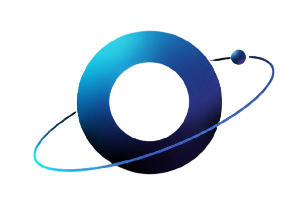
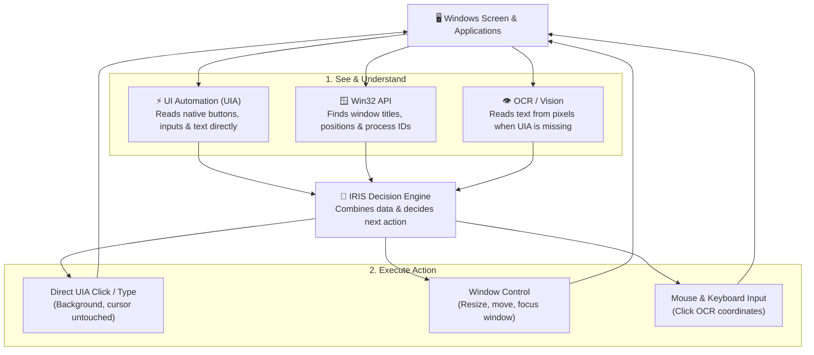

<div align="center">
  
  
  # IRIS: The Cognitive OS Layer
  
  **Autonomous Parallel Execution • Zero-Mouse-Takeover Desktop Automation • Ambient Workflow Intelligence**  
  *No fragile APIs. No cursor hijacking. If a human can see it and click it, IRIS can work with it.*

  <br>

  [](https://www.electronjs.org/)
  [](https://react.dev/)
  [](https://www.python.org/)
  [](https://fastapi.tiangolo.com/)
  [](https://learn.microsoft.com/en-us/windows/win32/)
  [](https://groq.com/)
  [](https://ai.google.dev/)
</div>

---

## ⚡ Why IRIS? The Paradigm Shift in OS Automation

Traditional automation tools fail modern workflows because they are fundamentally broken:
- **The Cursor Hijacking Problem:** Standard RPA and macro bots steal your mouse and keyboard, freezing you out of your computer while they run.
- **The API Barrier:** Tools like Zapier or Make rely strictly on public APIs, making them mathematically incapable of interacting with local software, proprietary tools, or offline apps.
- **The Visual Fragility Problem:** Hardcoded coordinate clickers break the moment a window is moved, scaled, or themed.
- **The Context Amnesia Problem:** Modern operating systems drop task context instantly when switching windows, forcing developers and knowledge workers to manually reconstruct environments.

**IRIS solves this by functioning as an Active Cognitive OS Layer** that runs parallel to your desktop, observes your environment through native accessibility and vision, executes tasks in true isolated virtual desktops, and restores your workflow context on demand.

---

## 🚀 Key Features & Capabilities

```
                  ┌─────────────────────────────────────────────────────────┐
                  │                 IRIS COGNITIVE OS LAYER                 │
                  └────────────┬──────────────────────────────┬─────────────┘
                               │                              │
        ┌──────────────────────▼─────────────┐ ┌──────────────▼────────────────────┐
        │     PARALLEL DESKTOP ENGINE        │ │    TRIANGULATED PERCEPTION        │
        │  • WinSta0\IRIS_ParallelDesktop    │ │  • UI Automation (UIA Tree)       │
        │  • Zero-Mouse Takeover Automation  │ │  • Win32 API Window & Process Mgr │
        │  • Real-Time MJPEG Stream Feed     │ │  • OCR & Visual Screen Grounding  │
        │  • Live Interactive Takeover       │ └───────────────────────────────────┘
        └──────────────────────┬─────────────┘
                               │
        ┌──────────────────────▼─────────────┐ ┌───────────────────────────────────┐
        │   ZERO-CLICK FLOATING DOSSIER HUD  │ │    META-OS & AMBIENT COMPANION    │
        │  • Instant On-Screen Delivery      │ │  • Natural Language Window Tiling │
        │  • Multi-Format Export (.txt/.doc/ │ │  • Project & Workspace Restoration│
        │    .pdf directly to Desktop)       │ │  • Always-On-Top Companion Blob   │
        │  • Visual Topic Badges & Markdown  │ │  • Watch & Strike (Spatial Loops) │
        └────────────────────────────────────┘ └───────────────────────────────────┘
```

### 1. 🖥️ Parallel Desktop Engine (`WinSta0\IRIS_ParallelDesktop`)
- **True Background Isolation:** Spawns a dedicated Win32 virtual desktop (`CreateDesktopW` / `SetThreadDesktop`). Applications, web browsers, and scripts run in an isolated environment without moving your physical mouse or stealing focus from your work.
- **Real-Time Live MJPEG Stream:** View what the autonomous agent is doing in real-time right inside the IRIS Dashboard.
- **Human-in-the-Loop Takeover:** Click, type, or scroll directly into the video feed to assist the agent with CAPTCHAs, 2FA, or login screens.

### 2. 📄 Zero-Click Floating Dossier HUD & Multi-Format Export
- **Proactive Delivery:** The moment an autonomous background task or deep research query completes, the **Floating Dossier HUD pops up on your screen**—no clicking through dashboard tabs required.
- **Multi-Format 1-Click Export:**
  - 📄 **Save as `.TXT`**: Instant plain-text report saved to `~/Desktop`.
  - 📝 **Save as `.DOC` / `.DOCX`**: Formatted Microsoft Word document with structured headings and tables.
  - 📕 **Save as `.PDF`**: Styled, printable document generated via ReportLab.
  - 📋 **Copy to Clipboard**: Quick-copy with `Esc` dismissal and toast feedback.
- **Visual Topic Strip:** Dynamically renders topic-matched visual cards, brand badges, and benchmark metrics.

### 3. 👁️ Triangulated Perception & Grounding (UIA + Win32 + OCR)
IRIS uses a 3-layer perception fusion engine to interact with any application:

```mermaid
flowchart TD
    Screen["🖥️ Windows Screen & Applications"]

    subgraph Perception ["1. See & Understand"]
        UIA["⚡ UI Automation (UIA)\nReads native buttons, inputs & text directly"]
        Win32["🪟 Win32 API\nFinds window titles, positions & process IDs"]
        OCR["👁️ OCR / Vision\nReads text from pixels when UIA is missing"]
    end

    IRIS["🧠 IRIS Decision Engine\nCombines data & decides next action"]

    subgraph Action ["2. Execute Action"]
        Act_UIA["Direct UIA Click / Type\n(Background, cursor untouched)"]
        Act_Win32["Window Control\n(Resize, move, focus window)"]
        Act_Mouse["Mouse & Keyboard Input\n(Click OCR coordinates)"]
    end

    Screen --> UIA
    Screen --> Win32
    Screen --> OCR

    UIA --> IRIS
    Win32 --> IRIS
    OCR --> IRIS

    IRIS --> Act_UIA
    IRIS --> Act_Win32
    IRIS --> Act_Mouse

    Act_UIA --> Screen
    Act_Win32 --> Screen
    Act_Mouse --> Screen
```

- **Level 1 — UI Automation (UIA):** Traverses the native accessibility tree to query controls (Buttons, TextBoxes, Menus) and invoke actions programmatically with zero cursor movement.
- **Level 2 — Win32 API:** Inspects top-level window geometry, active process IDs, z-order, and manages layout commands via direct OS handles.
- **Level 3 — Vision & OCR Fallback:** Captures screen pixels to ground text and buttons inside custom canvas apps, WebGL, Electron apps, or legacy UIs.

### 4. 🪟 MetaOS Window & Workspace Management
- **Natural Language Window Layouts:** Say or type commands like:
  - `"split 70/30 VS Code and Chrome"`
  - `"dev layout"` / `"tile side by side"`
  - `"zen mode"` / `"focus mode"` / `"spotlight active window"`
- **Workspace Memory & Context Switching:** Automatically tracks Git repositories, open files, terminal paths, and browser tabs, allowing you to restore an entire project workspace with a single command.

### 5. 🎯 Watch & Strike (Spatial Automation)
- **NOW:** Instantly pipes text or data from one on-screen window to another.
- **WHEN:** Visual trigger loops. Draw a trigger zone on screen and specify: *"When this build status says 'Passed', click Deploy."* IRIS watches in the background and strikes autonomously.
- **ALWAYS:** Continuous background synchronization between disconnected local apps.

---

## 🛠️ Tech Stack & Architecture

| Layer | Technologies |
| :--- | :--- |
| **Desktop Shell** | Electron 42, Node.js, TypeScript, Vite |
| **User Interface** | React 19, Lucide Icons, Cybernetic Glassmorphism CSS |
| **Backend Daemon** | Python 3.13, FastAPI, Uvicorn, AsyncIO |
| **Windows OS Layer** | `pywin32`, `UIAutomationCore` (comtypes / pywinauto), Windows GDI / BitBlt |
| **Document Export** | `python-docx` (.docx), `reportlab` (.pdf), `pypdf` |
| **Vision & OCR** | `EasyOCR`, `Pillow`, `OpenCV` |
| **LLM & Inference** | **Groq API** (`openai/gpt-oss-120b`, `qwen/qwen3.6-27b`, `groq/compound`), **Google Gemini 2.5 Flash**, Local **Ollama** |
| **Audio & Speech** | Web Speech API, Web Audio API Sound Synthesizer |

---

## ⚙️ Quick Start & Installation

### Prerequisites
- **Operating System:** Windows 10 or Windows 11 (64-bit)
- **Node.js:** v18.0 or higher
- **Python:** v3.11 – v3.13
- **Google Chrome:** Installed in standard directory (for Parallel Desktop browser sessions)

### 1. Clone the Repository
```bash
git clone https://github.com/AnushreeChatterjee2005/Iris-Cognitive-OS.git
cd Iris-Cognitive-OS
```

### 2. Install Frontend Dependencies
```bash
npm install
```

### 3. Setup Python Backend Environment
```powershell
# Create virtual environment
python -m venv iris_core\venv

# Activate virtual environment
.\iris_core\venv\Scripts\activate

# Install required Python packages
pip install -r requirements.txt
```

### 4. Environment Variables
Create a `.env` file in the project root:
```env
VITE_GEMINI_API_KEY=your_gemini_api_key
GROQ_API_KEY=your_groq_api_key
```

### 5. Launch the Application

#### Option A: Unified Startup
```bash
npm start
```
*Launches Ollama, the FastAPI backend daemon, and the Electron frontend simultaneously.*

#### Option B: Dual Terminal (Recommended for Development)
- **Terminal 1 (Backend Engine):**
  ```powershell
  cd iris_core
  .\venv\Scripts\activate
  python -m uvicorn main:app --host 127.0.0.1 --port 8000 --reload
  ```
- **Terminal 2 (Frontend & Electron):**
  ```bash
  npm run dev
  ```

---

## 🎮 Example Prompts to Try

| Category | Example Command | What IRIS Does |
| :--- | :--- | :--- |
| **Parallel Research** | `"compare Rust vs Go for backend microservices in background"` | Executes comparison on isolated virtual desktop; pops up Floating Dossier HUD with `.txt`, `.docx`, and `.pdf` export options. |
| **Autonomous Search** | `"research top AI hackathons in 2026 with prize pools in parallel"` | Discovers hackathons, parses dates/tracks/prizes, and delivers formatted dossier. |
| **MetaOS Layouts** | `"split screen 70/30 with VS Code on left and Chrome on right"` | Natively resizes and aligns windows to exact pixel ratios via Win32. |
| **Focus & Zen** | `"enter focus mode"` | Centers active window, minimizes distracting background apps, and sets zen opacity. |
| **Workspace Recall** | `"what was I working on yesterday in the Iris project?"` | Queries persistent SQLite timeline and offers 1-click workspace restoration. |

---

## 🔒 Privacy, Security & Guardrails

- **Local Execution First:** OS operations, window management, screen parsing, and virtual desktop automation execute 100% locally on your machine.
- **Isolated Process Sandboxing:** Background browser tasks run in isolated Chrome profile directories (`parallel_storage/browser_profile`) with separate cookies and cache.
- **Assist Mode Safety Gate:** High-consequence file writes and deep system actions require user confirmation before execution.
- **Zero Cursor Interruption:** Native UIA and Virtual Desktop actions never manipulate your active physical cursor unless explicitly requested.

---

## 👥 Authors & Acknowledgements

Developed for the **IRIS Cognitive OS Initiative**.

- **Anushree Chatterjee** ([@AnushreeChatterjee2005](https://github.com/AnushreeChatterjee2005))

---

<div align="center">
  <sub>Built with ❤️ for next-generation Human-AI Operating System Interaction.</sub>
</div>
